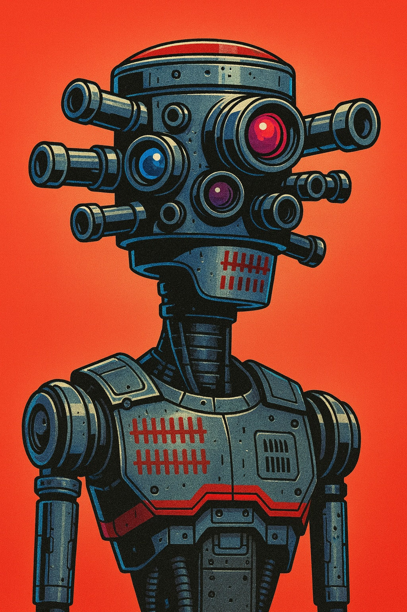

  

# R0N1N01 | Cybersecurity Lab Notes

Welcome to my Cybersecurity Lab Notes.  
This repository powers my personal site:  
**[ron1n01.com](https://ron1n01.com)**  

Here I share experiments, technical write-ups, and my journey from fundamentals to advanced topics in cybersecurity.  
These aren’t casual blog posts — they’re structured **lab experiments**.  

---

## About
I’m documenting my path step by step:  
-  **Now:** Security+ studies & blue team basics  
-  **Next:** Red team skills (offense, pentesting, exploit dev)  
-  **Future:** Purple team concepts (bridging defense & offense)  

---

##  Lab Sections
-  **Blue Team Defense** — SIEM, detection, log analysis  
-  **Red Team Fundamentals** — offensive techniques & labs  
-  **Purple Team Concepts** — long-term research goals  
-  **General Experiments** — scripts, configs, random tests  

---

##  Tech & Tools
  
  
  

---

##  Connect
-  [ron1n01.com](https://ron1n01.com)  
-  contact@ron1n01.com  

---

>  *“These notes are my battlefield journal — documenting both victories and mistakes as I sharpen my craft.”*  
